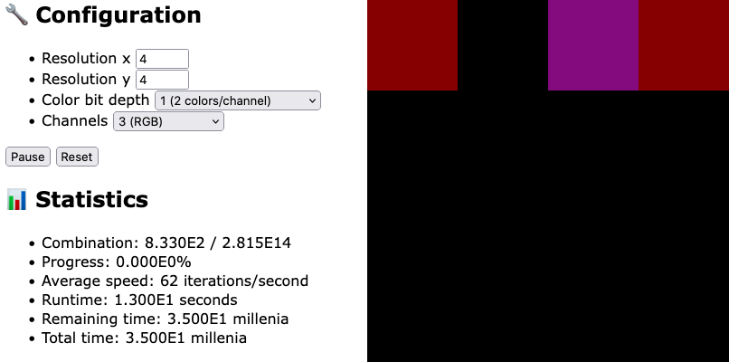

# All images

This repository hosts a simple script, written in JavaScript for the convenience of viewing, that generates every image possible within the provided resolution and color bit depth constraints.

**View the [live demo](https://nurgak.github.io/all-images/) here.**

Depending on the settings and iteration speed, the time to finish generating all the combinations might take more or less than the [heat death of the universe](https://en.wikipedia.org/wiki/Heat_death_of_the_universe).

There is no point to it. Enjoy.

## Usage

Set the resolution, color bit depth, color channels and hit run.

## License

This script is published under [MIT license](LICENSE).
